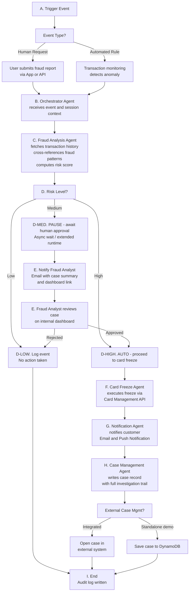
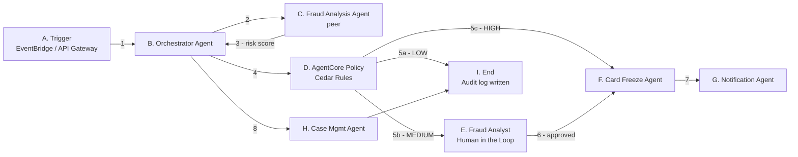
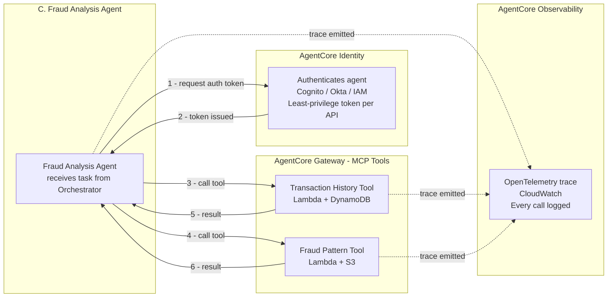

# UC1 - Real-Time Fraud Investigation Agent

---

## The Problem

Financial institutions process millions of transactions every day. When a potentially fraudulent transaction occurs, the window to act is narrow - seconds to minutes. Traditional fraud detection relies on rules engines that flag transactions, but the investigation and response process is largely manual: an analyst reviews the alert, looks up transaction history, cross-references known fraud patterns, decides whether to freeze the card, contacts the customer, and opens a case. This process is slow, inconsistent, and does not scale.

The challenge is not just detection - it is the end-to-end response: from the moment an anomaly is spotted to the moment the customer is protected and the case is documented, with a full audit trail that satisfies regulatory requirements.

---

## The Solution

This use case demonstrates how **Amazon Bedrock AgentCore** can power a real-time, autonomous fraud investigation system that handles the full response lifecycle - while keeping a human in the loop for decisions that require it.

A multi-agent system is triggered by either an automated rule (e.g. a transaction exceeds a threshold or originates from a high-risk country) or a direct human report (e.g. a customer flags a suspicious charge via the bank app). From that point, the system:

1. Autonomously retrieves and analyses the customer transaction history
2. Cross-references known fraud patterns to compute a risk score
3. Takes action based on the risk level - automatically for high-risk cases, or pausing for human approval on medium-risk cases
4. Freezes the card, notifies the customer, and records the full case with an audit trail

The key differentiator is the **human-in-the-loop** pattern for medium-risk cases: the agent pauses execution, notifies a fraud analyst with a case summary and a link to the review dashboard, and waits - without blocking any resources - until the analyst approves or rejects the action. This is made possible by AgentCore async extended runtime capability.

---

## Why AgentCore

AgentCore provides the production-grade infrastructure layer that makes this solution possible at scale. Without it, a team would need to build and maintain: secure agent deployment and scaling, session isolation between concurrent investigations, persistent memory across interactions, authenticated access to downstream APIs, policy enforcement for automated vs human-gated actions, and a full observability stack for audit. AgentCore handles all of this out of the box.

### AgentCore Capabilities Required

| Capability | Why it is needed |
|---|---|
| **Runtime** | Deploys and scales the multi-agent system; provides true session isolation so each fraud case runs in its own secure context; supports async extended runtime (up to 8h) for the human approval pause/resume pattern |
| **Memory** | Short-term memory maintains full investigation context within a session; long-term memory persists customer fraud history and pattern data across sessions, making the agent smarter over time |
| **Gateway** | Converts internal APIs (transaction history, card management, fraud pattern DB) and notification services into MCP-compatible tools the agents can call securely |
| **Policy** | Cedar rules enforce business logic deterministically - which risk levels trigger automatic action, which require analyst approval, and what the maximum autonomous freeze amount is |
| **Identity** | Manages agent authentication to each downstream system (card API, notification services, databases) using existing identity providers (Cognito, Okta, IAM) with least-privilege access |
| **Observability** | Traces every agent decision and action via OpenTelemetry to CloudWatch, producing a complete audit trail required for regulatory compliance (e.g. PCI-DSS, GDPR) |

### Human in the Loop

This solution includes an explicit human approval gate for medium-risk cases. This is not a fallback - it is a deliberate design choice that reflects real-world fraud operations, where fully automated decisions on ambiguous cases carry regulatory and reputational risk.

The flow is:
- The Orchestrator Agent receives the risk score from the Fraud Analysis Agent
- AgentCore Policy evaluates the score against Cedar rules
- If the risk is MEDIUM, the agent pauses execution and triggers a notification to the fraud analyst (email via SES with a case summary and dashboard link)
- The fraud analyst reviews the case on an internal dashboard and approves or rejects the freeze
- The agent resumes from the exact point it paused, with the analyst decision recorded in the audit trail
- If the risk is HIGH, the agent proceeds autonomously - no human approval required

This pattern demonstrates one of AgentCore most powerful capabilities: the ability to pause a long-running agent workflow, hand off to a human, and resume - all without polling, timeouts, or infrastructure complexity.

---

## Multi-Agent Architecture

This solution uses 5 specialised agents. The Orchestrator delegates to peer/sub-agents rather than executing everything itself - this is the core AgentCore multi-agent pattern being showcased.

| Agent | Type | Responsibility |
|---|---|---|
| Orchestrator Agent | Orchestrator | Receives trigger events, manages investigation lifecycle, enforces policy rules, coordinates all other agents, owns the async pause/resume for human approval |
| Fraud Analysis Agent | Peer agent | Independently analyses the transaction: fetches history, cross-references fraud patterns, computes risk score, returns structured result to Orchestrator |
| Card Freeze Agent | Sub-agent | Executes the card freeze action via Card Management API, confirms freeze status, reports back to Orchestrator |
| Notification Agent | Sub-agent | Handles all outbound communications - customer email, customer push notification, fraud analyst email with dashboard link |
| Case Management Agent | Sub-agent | Writes the full investigation record with audit trail; optionally integrates with external case management systems |

The **Fraud Analysis Agent** is designed as a peer agent because in production it could be independently deployed and reused across other use cases (loan underwriting, account opening). This makes the multi-agent story more compelling for customers.

---

## Functional Architecture

### Flow Description

| Step | Actor | Description |
|---|---|---|
| Trigger | EventBridge / API Gateway | Event fired by automation rule or human report |
| Orchestrator Agent | AgentCore Runtime | Receives event, initialises session, coordinates all agents |
| Fraud Analysis Agent | AgentCore Runtime | Fetches tx history, checks fraud patterns, scores risk |
| Human Approval (medium risk) | Fraud Analyst | Agent pauses async; analyst notified via email, reviews on dashboard, approves or rejects |
| Card Freeze Agent | AgentCore Runtime | Calls Card Management API to freeze card |
| Notification Agent | AgentCore Runtime | Sends email + push notification to customer |
| Case Management Agent | AgentCore Runtime | Writes full case record; optionally integrates with external CRM |
| Audit Log | AgentCore Observability | Every step traced and stored for regulatory trail |

---

## Agent Interaction

> Node letters (A, B, C...) match the functional architecture diagram steps.
> Arrow numbers show the order of calls.

---

## Fraud Analysis Agent - Security and Observability

> This diagram shows how AgentCore Gateway, Identity and Observability work
> for the Fraud Analysis Agent. The same pattern applies to all agents.

---

## AWS Services

| AgentCore Component | AWS Service | Role |
|---|---|---|
| Runtime | AgentCore Runtime | Hosts all 5 agents with session isolation and async pause/resume |
| Memory | AgentCore Memory | Short-term session context + long-term fraud history |
| Gateway - Transaction History | Lambda + DynamoDB | Fetches customer transaction data (synthetic for demo) |
| Gateway - Fraud Patterns | Lambda + S3 | Cross-references known fraud patterns (mock rules for demo) |
| Gateway - Card Management | Lambda | Executes card freeze (mock for demo, real API in production) |
| Gateway - Email | Amazon SES | Notifies customer and fraud analyst |
| Gateway - Push | Amazon SNS | Push notification to customer mobile app |
| Gateway - Case Mgmt | Lambda + DynamoDB | Writes case record (optional: Salesforce / CRM adapter) |
| Policy | AgentCore Policy | Cedar rules enforcing freeze thresholds and approval gates |
| Identity | Amazon Cognito / IAM | Agent authentication to downstream APIs |
| Observability | AgentCore Observability + CloudWatch | OpenTelemetry traces, full audit trail |
| Analytics | Amazon QuickSight | Fraud case dashboard and trend analysis |
