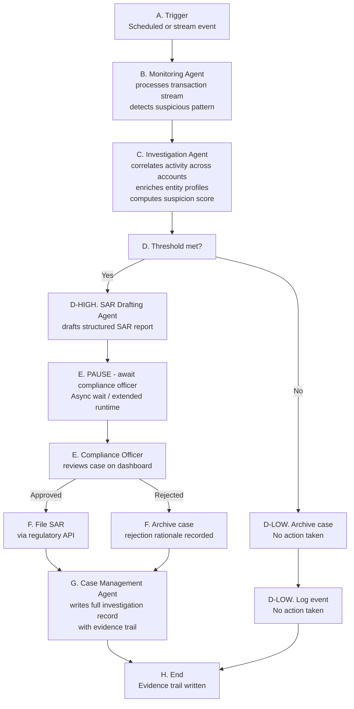
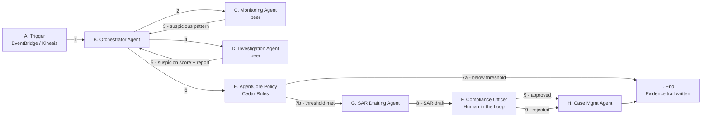
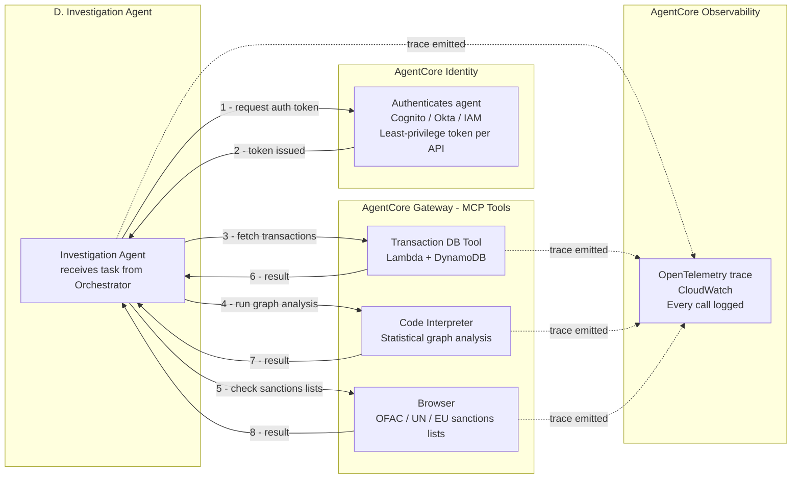

# UC2 - Autonomous AML / Compliance Monitoring Agent

---

## The Problem

Anti-Money Laundering (AML) compliance is one of the most resource-intensive operations in financial services. Compliance teams are required to continuously monitor transactions, identify suspicious activity patterns, research entities against sanctions lists, and file Suspicious Activity Reports (SARs) with regulators - all within strict deadlines. The volume of data involved is enormous: a mid-size bank may process hundreds of thousands of transactions per day, and the number of false positives generated by traditional rule-based systems is high, leading to analyst fatigue and missed genuine threats.

Manual investigation is slow, expensive, and error-prone. Regulatory penalties for AML failures are severe - both financially and reputationally. The challenge is to monitor continuously, investigate thoroughly, and document everything - at a scale that human teams alone cannot sustain.

---

## The Solution

This use case demonstrates how **Amazon Bedrock AgentCore** can power an autonomous AML monitoring system that runs continuously as a long-running async workload - processing transaction streams, correlating suspicious activity, and managing the full SAR lifecycle while keeping a compliance officer in the loop before any report is filed.

The system:

1. Continuously processes transaction streams and correlates suspicious activity across accounts and time windows
2. Researches entities against public sanctions lists and regulatory databases
3. Runs statistical analysis on transaction graphs to identify layering and structuring patterns
4. Drafts structured investigation reports and - where thresholds are met - initiates the SAR filing process
5. Routes all findings to a compliance officer for review and sign-off before filing

The key differentiator is AgentCore's **extended runtime (up to 8 hours)**, which handles the long-running nature of AML investigations that often require correlating activity across days or weeks of transaction history.

---

## Why AgentCore

AML monitoring requires infrastructure that can sustain long-running workloads, integrate with external data sources in real time, enforce strict filing thresholds, and produce a defensible evidence trail for regulators. Without AgentCore, a team would need to build and maintain all of this from scratch. AgentCore handles it out of the box.

### AgentCore Capabilities Required

| Capability | Why it is needed |
|---|---|
| **Runtime** | Supports long-running async workloads (up to 8h) to handle multi-day transaction correlation; deploys and scales the multi-agent system |
| **Browser** | Scrapes public sanctions lists (OFAC, UN, EU), regulatory bulletins, and company registries to enrich entity profiles in real time |
| **Code Interpreter** | Runs statistical analysis on transaction graphs to identify layering and structuring patterns that simple rules would miss |
| **Gateway** | Connects to internal case management systems, transaction databases, and regulatory APIs as MCP-compatible tools |
| **Policy** | Cedar rules enforce SAR filing thresholds and human approval gates - no SAR is filed without compliance officer sign-off |
| **Observability** | Captures a complete evidence trail for every finding, required for regulatory defensibility |

### Human in the Loop

No SAR is filed without a compliance officer reviewing and approving the finding. This is a regulatory requirement, not just a design choice.

The flow is:
- The Monitoring Agent identifies a suspicious pattern and triggers an investigation
- The Investigation Agent correlates activity, enriches entity profiles, and drafts a structured report
- AgentCore Policy evaluates whether the SAR filing threshold is met
- If the threshold is met, the agent pauses and routes the report to the compliance officer for review
- The compliance officer approves or rejects the filing via an internal dashboard
- The agent resumes and either files the SAR or archives the case with the rejection rationale recorded

---

## Multi-Agent Architecture

| Agent | Type | Responsibility |
|---|---|---|
| Orchestrator Agent | Orchestrator | Manages the monitoring lifecycle, coordinates all agents, owns the async pause/resume for compliance officer approval |
| Monitoring Agent | Peer agent | Continuously processes transaction streams, detects suspicious patterns, triggers investigations |
| Investigation Agent | Peer agent | Correlates activity across accounts and time windows, enriches entity profiles, computes suspicion score |
| SAR Drafting Agent | Sub-agent | Produces a structured SAR draft with full evidence references, ready for compliance officer review |
| Case Management Agent | Sub-agent | Writes the full investigation record with evidence trail; integrates with GRC or case management systems |

The **Monitoring Agent** and **Investigation Agent** are designed as peer agents because they can be independently deployed and reused - the Monitoring Agent could serve other use cases (fraud, market abuse), and the Investigation Agent could be invoked on demand for ad-hoc entity research.

---

## Functional Architecture

### Flow Description

| Step | Actor | Description |
|---|---|---|
| Trigger | EventBridge / Kinesis | Scheduled batch or real-time stream event |
| Orchestrator Agent | AgentCore Runtime | Initialises long-running session, coordinates all agents |
| Monitoring Agent | AgentCore Runtime | Processes transactions, detects suspicious patterns |
| Investigation Agent | AgentCore Runtime | Correlates activity across accounts and time windows; enriches entities via Browser (sanctions status, ownership structures) and Code Interpreter (fund flow graphs, structuring indicators, round-tripping patterns) |
| Human Approval | Compliance Officer | Agent pauses async; officer reviews SAR draft on dashboard — draft includes subject entity details, transaction timeline, total amounts moved, layering evidence, sanctions matches, and statistical anomaly scores — approves or rejects |
| SAR Drafting Agent | AgentCore Runtime | Produces structured SAR draft with full evidence references: entity profiles, correlated transaction sequences, Code Interpreter outputs, and Browser-sourced sanctions data |
| Case Management Agent | AgentCore Runtime | Writes full case record; integrates with Governance, Risk and Compliance system |
| Evidence Trail | AgentCore Observability | Every step traced and stored for regulatory defensibility |

---

## Agent Interaction

> Node letters (A, B, C...) match the functional architecture diagram steps.
> Arrow numbers show the order of calls.

---

## Investigation Agent - Security and Observability

> This diagram shows how AgentCore Browser, Gateway, Identity and Observability work
> for the Investigation Agent. The same pattern applies to all agents.

---

## AWS Services

| AgentCore Component | AWS Service | Role |
|---|---|---|
| Runtime | AgentCore Runtime | Hosts all agents with long-running async support (up to 8h) |
| Memory | AgentCore Memory | Short-term session context + long-term entity and case history |
| Browser | AgentCore Browser | Scrapes OFAC, UN, EU sanctions lists and regulatory bulletins — extracts entity names, sanction dates, listed jurisdictions, associated aliases, and ownership structures from public registries |
| Code Interpreter | AgentCore Code Interpreter | Statistical graph analysis for layering and structuring detection — produces transaction velocity metrics, fund flow graphs, round-tripping indicators, structuring patterns (transactions just below reporting thresholds), and network centrality scores for high-risk entities |
| Gateway - Transaction DB | Lambda + DynamoDB | Fetches transaction data for correlation — account numbers, transaction amounts, timestamps, counterparty details, originating and destination countries, payment references, and historical transaction sequences (synthetic for demo) |
| Gateway - Case Management | Lambda + DynamoDB | Writes case records (optional: ServiceNow / Governance, Risk and Compliance system adapter) |
| Gateway - SAR Filing | Lambda | Submits SAR to regulatory API (mock for demo, real API in production) |
| Gateway - Notifications | Amazon SES | Notifies compliance officer for review |
| Policy | AgentCore Policy | Cedar rules enforcing SAR filing thresholds and human approval gates |
| Identity | Amazon Cognito / IAM | Agent authentication to downstream APIs |
| Observability | AgentCore Observability + CloudWatch | OpenTelemetry traces, full evidence trail |
| Analytics | Amazon QuickSight | AML case dashboard and trend analysis |
